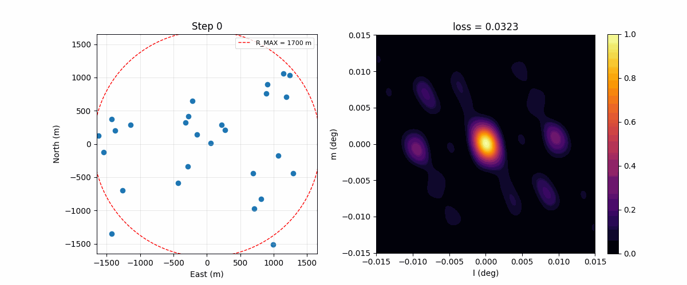

[](https://github.com/ARGOS-telescope/argosim/actions/workflows/ci-build.yml)
[](https://argos-telescope.github.io/argosim/)
[](https://pypi.org/project/argosim/)
[](https://github.com/ARGOS-telescope/argosim/blob/main/LICENSE) 

# Argosim
`argosim` is a lightweight, modular, and open-source Python package for simulating radio interferometric observations. It is developed as part of the [ARGOS](https://argos-telescope.eu) project, a European initiative to build a next-generation, sustainable radio interferometer.

## ✨ Key Features

* 📡 Antenna array simulation – Generate custom arrays or load predefined layouts.
* 🔭 Aperture synthesis – Compute baseline distributions and uv-sampling masks.
* 🌀 Sky model generation – Create or load input sky models.
* 🧼 Dirty beam and image reconstruction – Simulate dirty observations and reconstruct images using CLEAN.
* 📊 Beam and image quality metrics – Evaluate beam shape, sidelobe level, and image fidelity.
* ⚡ JAX backend – Accelerated, differentiable computations for high-performance and ML applications.
* 🐳 Docker support – Easy reproducibility and cross-platform compatibility.

## ⚡ JAX & differentiability (under development in branch:develp)
The imaging forward model — baselines, UV-track generation, Kaiser–Bessel convolutional gridding, FFT — is implemented end-to-end in JAX, so the path from **antenna positions** all the way to the **dirty image** is differentiable. Combined with an `optax` optimiser, this turns array layout design into a gradient-based problem: you can directly minimise a loss on the dirty beam (or any downstream observable) with respect to the antenna coordinates.

The animation below shows 20 antennas being optimised with Adam to match a Gaussian target beam, under multiple physical constraints (minimum spacing, maximum site radius). The reusable building blocks live in `argosim.optim_utils`; see [`notebooks/array_optim/test_array_optim.ipynb`](notebooks/array_optim/test_array_optim.ipynb) for the full example.



## 🚀 Getting Started
### Installation
You can install the latest version of `argosim` via pip:
```bash
pip install argosim
```
Or use the development version directly from GitHub:
```bash
git clone https://github.com/ARGOS-telescope/argosim.git
cd argosim
pip install -e .
```

### Dependencies
* Python 3.11+
* NumPy, Matplotlib, JAX, scikit-image
* PyQt6 (optional, for running the GUI)

## 🖥️ Graphical User Interface (GUI)
`argosim` provides an optional PyQt6-based GUI for interactive simulations. It supports array configuration, uv-coverage visualization, and imaging—all without writing code.

> Ideal for education, outreach, and rapid prototyping.

Running the GUI requires `PyQt6` which can be installed as follows:
```bash
pip install "argosim[gui]"
```

To launch the GUI and have access to the custom templates you need to clone the `argosim` repository:
```bash
git clone https://github.com/ARGOS-telescope/argosim.git
cd argosim
```

Launch the GUI with:
```bash
python app/argosim-gui.py
```

## 📚 Documentation
Comprehensive documentation is available at:
>[https://argos-telescope.github.io/argosim/](https://argos-telescope.github.io/argosim/)

## 📖 Tutorials
Four interactive Jupyter notebooks are provided to help you get started:
1. [Antenna Array Simulation](https://github.com/ARGOS-telescope/argosim/blob/main/tutorial/notebooks/tuto_1_antenna_utils.ipynb)
2. [Aperture Synthesis](https://github.com/ARGOS-telescope/argosim/blob/main/tutorial/notebooks/tuto_2_uv-tracks.ipynb)
3. [Image reconstruction](https://github.com/ARGOS-telescope/argosim/blob/main/tutorial/notebooks/tuto_3_imaging.ipynb)
4. [CLEAN deconvolution](https://github.com/ARGOS-telescope/argosim/blob/main/tutorial/notebooks/tuto_4_clean.ipynb)

These notebooks cover the main functionalities of `argosim` and provide practical examples.

## 🐳 Docker
A pre-built Docker image is available:
```bash
docker pull ghcr.io/argos-telescope/argosim:main
```
This ensures reproducibility and simplifies setup across different environments.

## 🛠️ Development
We use continuous integration to maintain code quality and robustness:
* Unit tests with `pytest`
* Linting with `black` and `isort`
* Documentation building with `sphinx`

## 📢 Citation
If you use `argosim` in your research, please cite it as follows:
```bibtex
@software{argosim,
  author = {Ezequiel Centofanti and Emma Ayçoberry and Samuel Farrens and Samuel Gullin and Manal Bensahli and Jean-Luc Starck and John Antoniadis},
  title = {argosim: a Python package for radio interferometric simulations},
  version = {1.0.1},
  year = {2025},
  url = {https://github.com/ARGOS-telescope/argosim}
}
```
fill in the version number with the current version of `argosim`.

This software is developed at the [CosmoStat](https://www.cosmostat.org/) laboratory, CEA, Paris-Saclay, in collaboration with the [ARGOS](https://argos-telescope.eu) project.

## 📬 Contact
For questions, bugs, or feature requests, feel free to [open an issue](https://github.com/ARGOS-telescope/argosim/issues/new/choose). 
