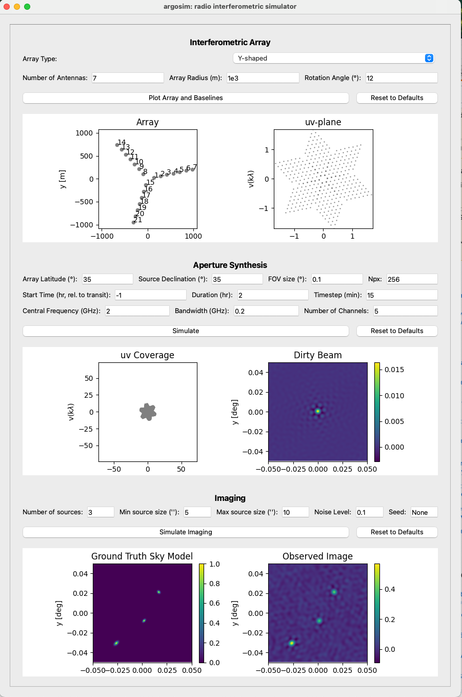

# Argosim GUI

`argosim` provides an optional PyQt6-based GUI for interactive simulations. It supports array configuration, uv-coverage visualization, and imaging—all without writing code.

> Ideal for education, outreach, and rapid prototyping.

## Installation
Running the GUI requires the `pyQt6` package, which can be installed with the following command:
```
pip install argosim[gui]
```

## Launching the GUI
For opening the GUI, run the following command:
```
python app/argosim-gui.py
```

## Example


> Argosim graphical user interface (GUI) for radio interferometric simulations.